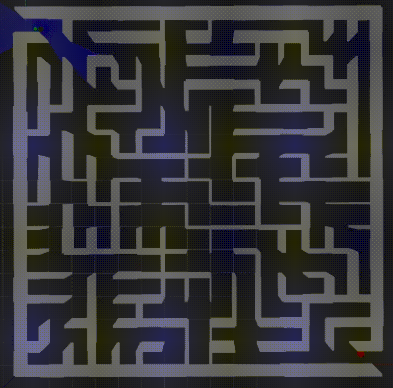

# Maze Solver

This branch implements an **autonomous maze-solving system** using **SLAM** and **Nav2** in ROS 2.  

The core component is a **Frontier Explorer node** that identifies unmapped regions and incrementally expands the exploration horizon until the goal is reached.

---

## Features

- SLAM-based online map building  
- Nav2 navigation and path planning  
- **Frontier-driven exploration** with density filtering  
- Goal-aware behavior that commits to the goal when detected  
- Real-time visualization of frontiers and target in RViz  

---

## Frontier Explorer Node

The `FrontierExplorer` node drives exploration with the following logic:  

- Detects frontiers in the occupancy grid and scores them based on distance, cost, and information density.  
- Avoids sparse or low-information areas to optimize exploration.  
- **Probabilistic target selection:** new targets are chosen from the frontiers, with a **2/3 probability of selecting a farther frontier** to balance exploration and exploitation.  
- Automatically switches from exploration to goal navigation when the goal is detected.  
- Publishes all frontiers and the current target for RViz visualization.  

---

## Demo

The demo shows **simultaneous exploration in RViz** and the **robot motion in Gazebo**:

| RViz (Exploration & Map) | Gazebo (Robot Motion) |
|--------------------------|----------------------|
|      |  |

**Notes on visualization:**  
- **Blue points** in RViz indicate newly explorable frontiers.  
- The robot probabilistically selects its next target among these points, usually favoring farther points to improve map coverage while still considering nearby frontiers.  
- The GIF demonstrates both frontier expansion and the robot’s motion as the map grows in real time.  
