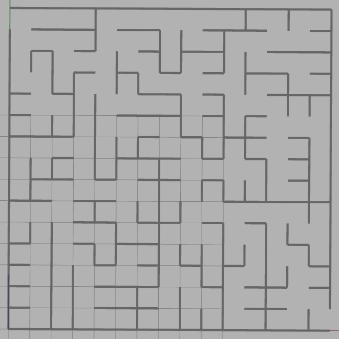

# Maze Creation

This branch builds the logic for setting up the maze for the robot. These mazes are generated using the following algorithms:

- Depth First Search (DFS)
- Prim's algorithm

Each maze is a **perfect maze** (no loops) and is translated into a **Gazebo world** for the robot to navigate.  

## Features

- Fully enclosed outer boundaries with **one entry and one exit**  
- Gazebo-compatible walls with **brick texture**  
- Floor plane with **asphalt texture**  
- Top-view images of the maze and the **solution path**  
- Supports both **DFS** and **Prim's algorithm** for maze generation

## Demo

Below is a demo of a generated 10x10 maze in Gazebo:

